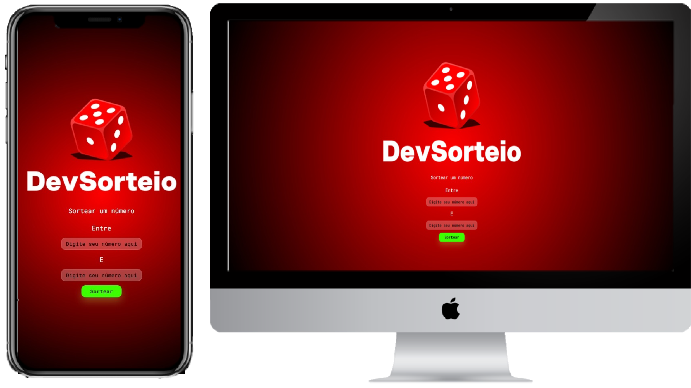

[Projeto ONLINE, experimente agora](https://anderdev-github.github.io/DevSorteio/)  

<h3 align="center">
  Seja bem-vindo ao meu projeto DevSorteio!
</h3>

 

  <a href="#house-Sobre-o-projeto">Sobre o projeto</a>&nbsp;&nbsp;&nbsp;|&nbsp;&nbsp;&nbsp;
  <a href="#computer-Tecnologias">Tecnologias</a>&nbsp;&nbsp;&nbsp;|&nbsp;&nbsp;&nbsp;
  <a href="#tutorial-Como-Usar">Como Usar</a>&nbsp;&nbsp;&nbsp;|&nbsp;&nbsp;&nbsp;
  <a href="#license-Licença">Licença</a>&nbsp;&nbsp;&nbsp;|&nbsp;&nbsp;&nbsp;
  <a href="#developer-Autor">Autor</a>&nbsp;&nbsp;&nbsp;|&nbsp;&nbsp;&nbsp;

 

 

## :house: Sobre o projeto

DevSorteio é um projeto simples que permite que você sorteie um número aleatório dentro de um intervalo especificado. Este projeto é uma página da web criada com HTML, CSS e JavaScript.

## :open_book: Como Usar

1. Clone ou baixe este repositório em sua máquina local.

2. Abra o arquivo index.html em seu navegador.

3. Na página, você verá um campo de entrada para inserir um número mínimo e outro campo para inserir um número máximo do intervalo que você deseja sortear.

4. Insira os valores mínimo e máximo desejados nos campos de entrada.

5. Clique no botão "Sortear".

6. Um número aleatório dentro do intervalo especificado será exibido na tela.

7. Você pode repetir o processo quantas vezes desejar, inserindo novos valores no campo de entrada e clicando em "Sortear" novamente.

## :zap: Tecnologias

-  : Página HTML principal que contém os elementos da interface do usuário.
-  : Arquivo CSS que define o estilo da página.
-  : Arquivo JavaScript que contém a lógica para gerar números aleatórios e interagir com a página.
 

## :balance_scale: Licença

Este projeto é de código aberto e está sob a licença Licença MIT. Você é livre para usar, modificar e distribuir este projeto de acordo com os termos da licença.

## :technologist_light_skin_tone: Autor

Feito com ♥ por Anderson Leite :wave: [Entre em contato!](https://www.linkedin.com/in/andersondiasleite/)
